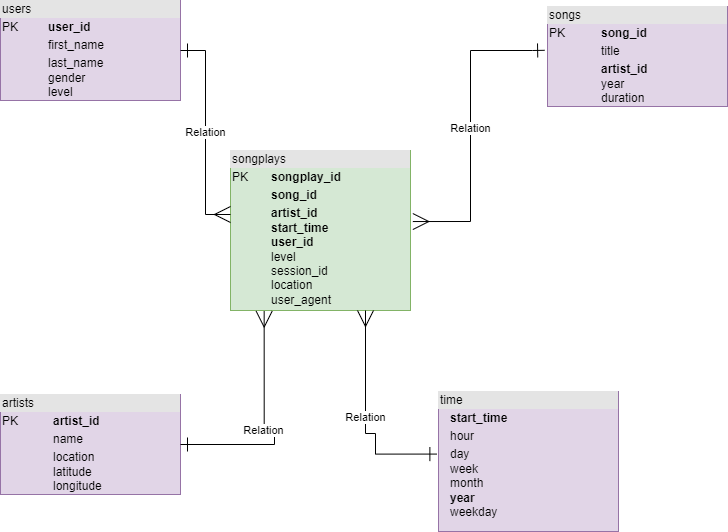

# Data Warehouse

The purpose of this project is to load data from S3 into Redshift for Analytic, The JSON data from S3 bucket will be cipied to staging table in Redshift before the data will being inserted into a star schema with fact and dimention tables. A star schema help to query quickly and aggregation are fast.

## How to run the Python scripts

Open terminal

### Run python script to create database and tables

`python3 create_tables.py`

Once run that file the staging tables like staging_events and staging_songs will be created, the fact and dimention tables such as songplays, users, songs, artists, time will be created as well. The script also delete all tables in advance if exists as well.

### Run python script to execute ETL

`python3 etl.py`

Once run that file successfully, All data from S3 will be loaded into staging tables and then Data from staging tables will be loaded into Fact & Dimention Tables in RedShift DB. JSON song files are from `s3://udacity-dend/song_data` and JSON log files are from `s3://udacity-dend/log_data`.

## Database schema design

## Example queries for song play anlysis

Count number of staging_songs in database

`SELECT count(*) FROM staging_songs`

Count number of songs in database

`SELECT count(*) FROM songs`

Get users & songs

`SELECT u.user_id,
        s.song_id,
        u.last_name,
        sp.start_time,
        a.name,
        s.title
FROM songplays AS sp
        JOIN users   AS u ON (u.user_id = sp.user_id)
        JOIN songs   AS s ON (s.song_id = sp.song_id)
        JOIN artists AS a ON (a.artist_id = sp.artist_id)
        JOIN time    AS t ON (t.start_time = sp.start_time)
ORDER BY (sp.start_time)
LIMIT 1000;`